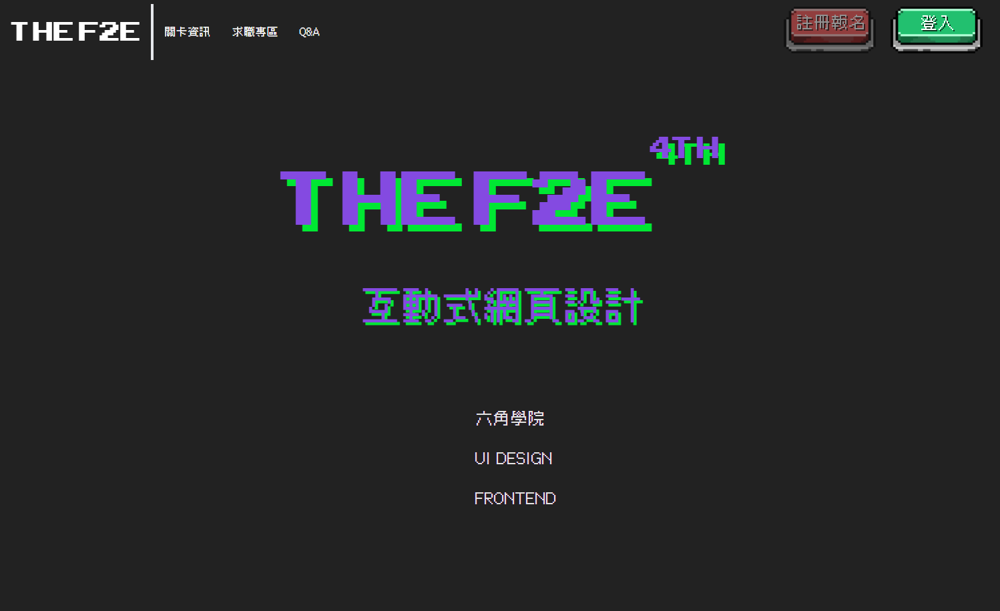

# The F2E 前端 & UI 修煉精神時光屋
# 

# 專案說明：

-[2022 The F2E 4th](https://2022.thef2e.com/)，第一關 - [「The F2E 活動網站設計」](https://2022.thef2e.com/news/week1)

-請使用1920x1080解析度預覽

## 使用技術：

- HTML 
- React
- Vite
- Gsap
- Tailwind

## 採用設計稿資訊：

- 設計稿提供：Ann Chen
- 設計稿網址：https://www.figma.com/file/TeFt6RMLzPvt4p7lNFhED2/THE-F2E-WEEK1

## 個人投稿資訊：

- 個人資訊：
  email: sshane258@gmail.com
  
- 投稿位址：

## Demo：
   https://a2020chin.github.io/2022F2E-w1/

